## House Price Predictor 
### UC Berkeley Boot Camp, May 2019
#### By: Amitava Samadaar, Prem Ganesh Elango & Suvrangshu Ghosh
----------------------------------------------------------------

## The Process

1 st:
Loading data and analyse data skewness

2 nd:
Multivariable Analysis
Numerical and Categorical
features Analysis, Plotting

3 rd:
Transformation/Engineering, ,
Data cleanup, missing values,
Plotting, Correlation matrix,
convert categorical columns to numerical

4th:
Modeling and Predictions using
Random Forest,KNN & DecissionTree Regressor

### Understanding the data

Dataset has 79 columns/ many characteristics define price value

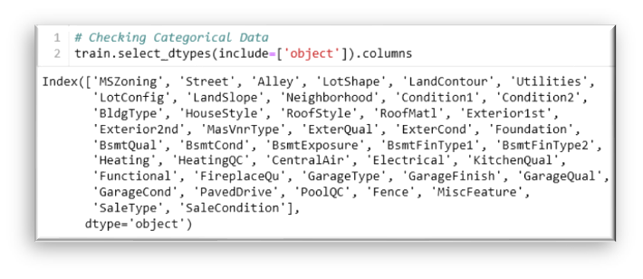

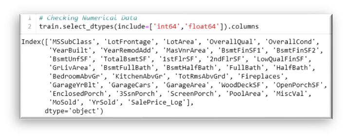

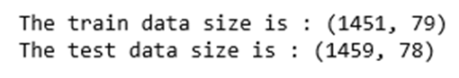

# Analysing the data

### Checking the Skewness of the data
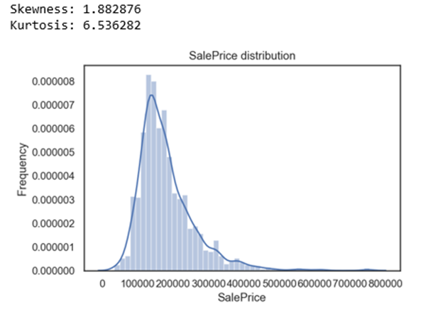

This distribution is positively skewed.

Notice that the blue curve is more
deviated towards the right.

It is recommended to fix the skewness to
make good decisions by the model.

### Correcting the Skewnwss

Okay, So how do I fix the skewness?

The best way to fix it is to perform a log
transform of the same data,with the intent
to reduce the skewness.

After taking logarithm of the same data
the curve seems to be normally
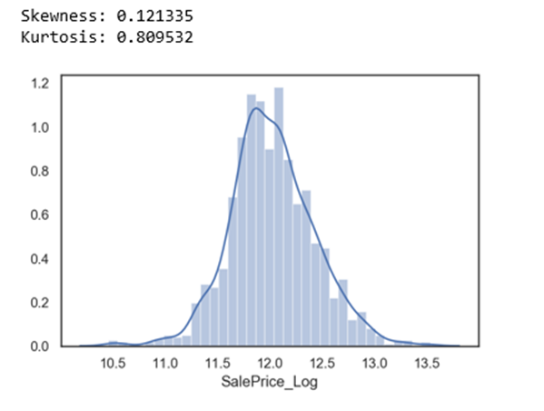

Reading about Log Transformation:
http://fmwww.bc.edu/repec/bocode/t/transint.htmldistributed

Need to find top 20
features related to sales
price, using correlational
matrix
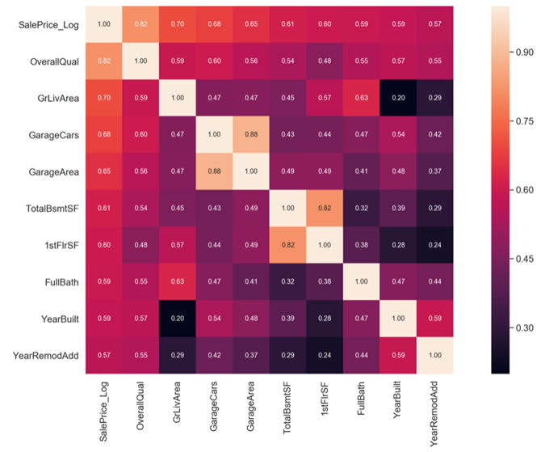

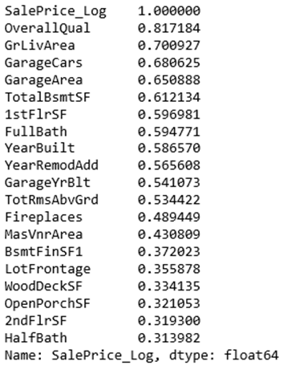

#### How important in correlational level?
#### Plotting various graphs to understand the importance against sales price.

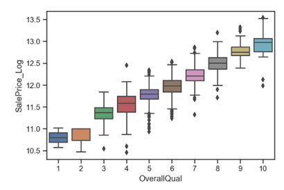

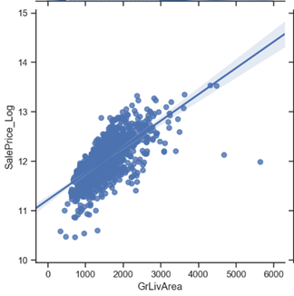

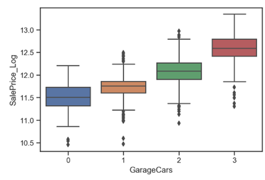

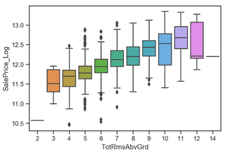

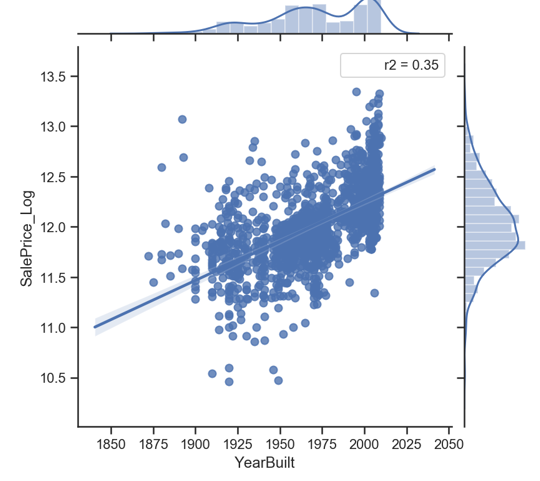

Identify the outliers and clean up the data.

#### Identifying Categorical and Numerical variables

80 Categorical variable

# 43 Catagorical varibles

# 37 Numerical Variables

# Total 80

# Multivariable Analysis

#### Data Cleanup

**How important is the missing data**? **How many missing? Wrong deletion can effect analysis**

### Find missing data

Look for null values
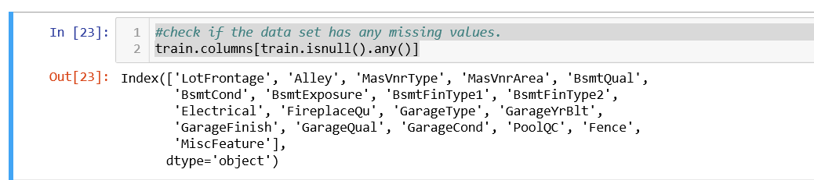

### Plot the missing values to see how many null.
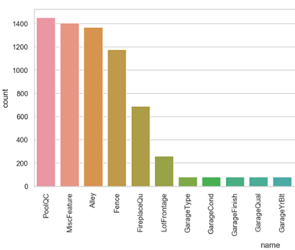

convert Null to 'None'
take mean() value of numrical variables and replace with missing 

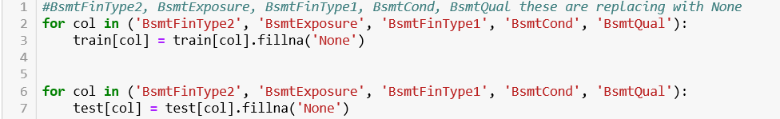

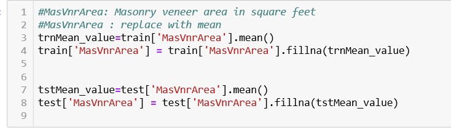

#### Transformation and Engineering:

**Data conversion Convert categorical data to numeric**

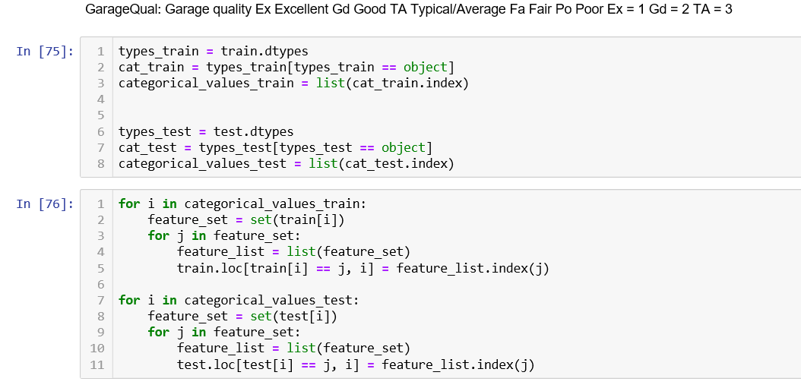

### Use multiple regression models

#### Random Forest
Train the dataset -  (about 80:20 split)

Results:
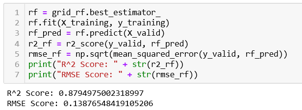

Prediction:
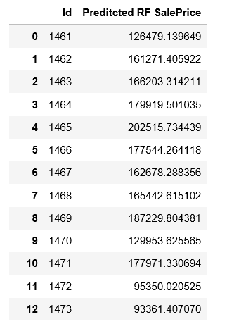

Plot  Actuals Vs Predicted 
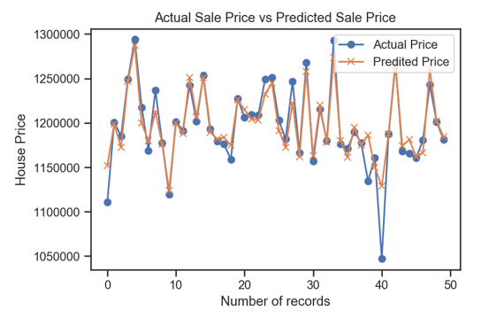

### Decision Tree Regressor

Results compare with Random Forest Vs Decission Tree prediction
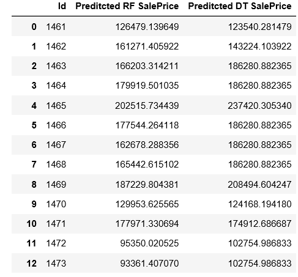

#### K-Nearest Neighbor Regressor
##### Compare results of models Visualize Prediction Vs Actuals
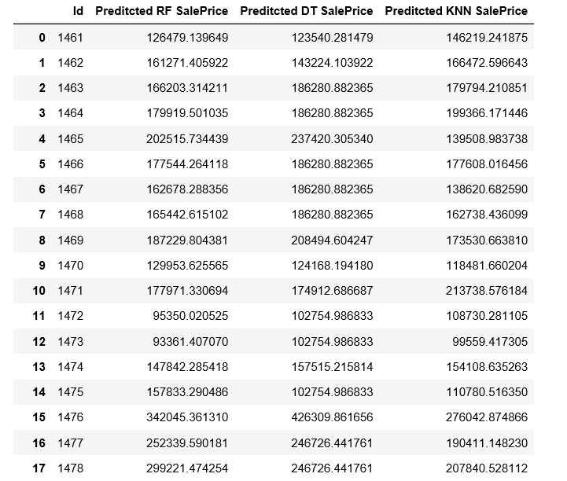

Which model is giving the best predictions

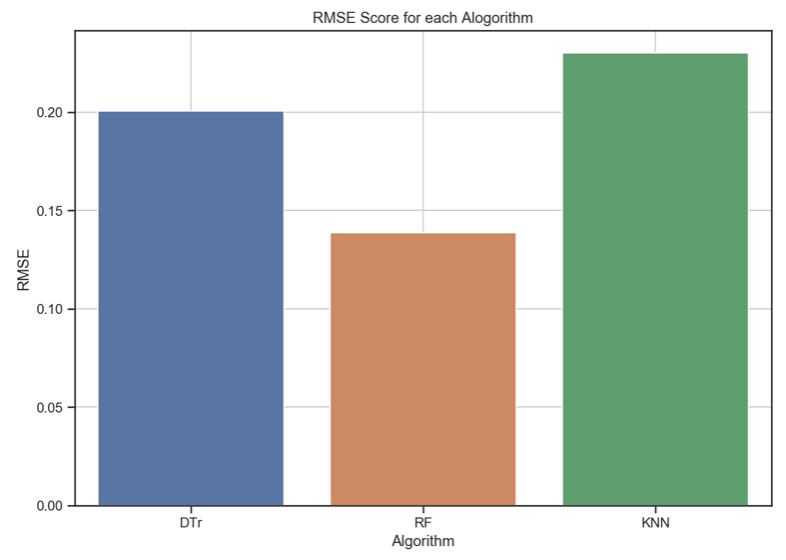

# Conclusion
Looking in to the predictions given by Random Forest,
Decision Tree and KNN.
We see that Random Forest Regression has the lowest RMSE value.
We can conclude that, here Random Forest Regression
method provides the most accurate home price predictions
between the other three in this case.

# Research

About Skewed dataset : https://becominghuman.ai/how-to-deal-with-skewed-dataset-in-machine-learning-afd2928011cc
Regression: https://towardsdatascience.com/introduction-to-machine-learning-algorithms-linear-regression-14c4e325882a

### Issues faced:

- Too many characteristic
- Understanding Skewed data

